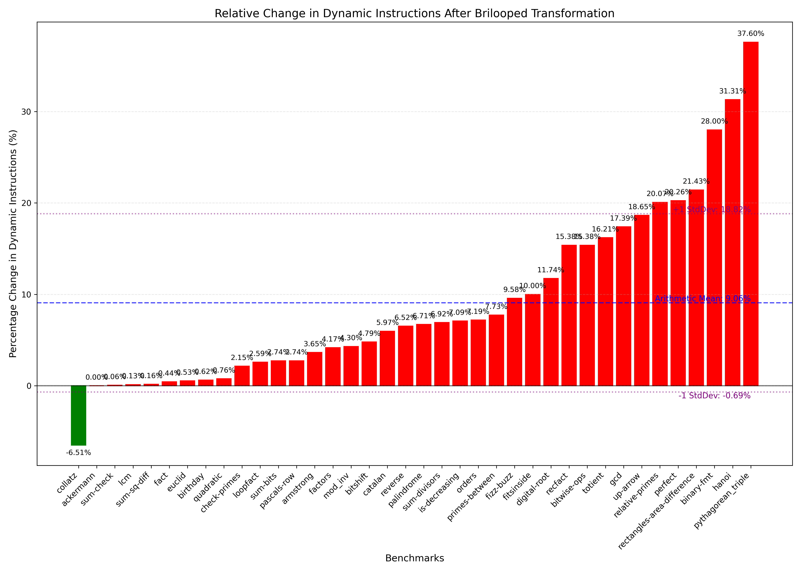
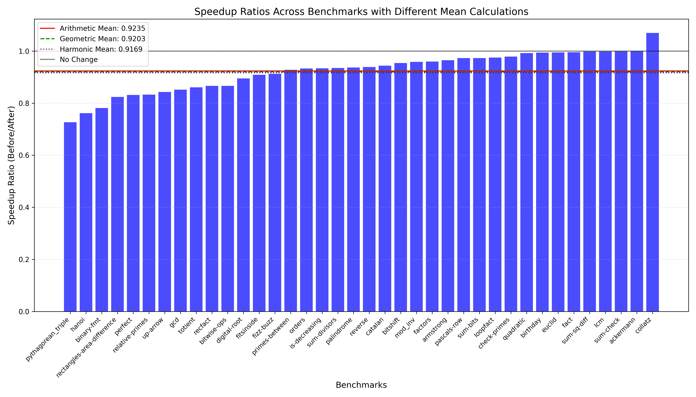
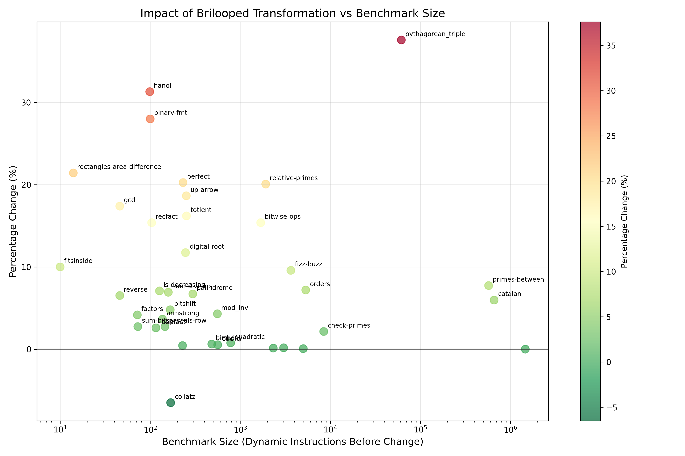

+++
title = "Brilooped"
[[extra.authors]]
name = "Gerardo Garcia Teruel Noriega"
[[extra.authors]]
name = "Dev Patel"
+++

# Brilooped

## Abstract

In this project we introduce Briloop, an extension intto the [Bril programming language](https://capra.cs.cornell.edu/bril/) that supports structured control flow, this allows bril programs to use if-then-else, while, and block statements instead of relying on jumps and branches. We also implemented Ramsey's [Beyond Relooper](https://dl.acm.org/doi/10.1145/3547621) to translate bril programs into briloop automatically, having a an average performance penalty of 9% when using the core bril benchmarks. Brilooped not only enables programmers to write bril programs with structured control flow, but also enables a translation from [Bril into WebAssembly]().  

## Representing Briloop Programs

Brilooped programs extends the Bril instruction set with the following op codes: while, block, if, break, and continue. 
Brilooped extends the Bril instruction set with new control flow operations that provide structured alternatives to jumps and labels. These new op codes allow programmers to write more readable and maintainable code with familiar control flow constructs like loops and conditionals. This structured control flow can also be useful for specific applications such as WASM.

### `while`

The `while` operation introduces a structured loop into Bril programs:

- It takes exactly one argument: a string containing the name of a boolean variable that serves as the loop condition.
- It includes an additional `children` field that contains an array of arrays of `Instr` objects representing the loop body.
  - Note: this is an array of arrays to make the language a little more uniform (children field is used in both while loops and if-then-else statements)
- The condition is evaluated before each iteration. If true, the body executes; if false, the loop terminates.
- The instructions within the loop body are responsible for potentially updating the condition variable.

Example usage:

```json
{
  "args": [
    "cond"
  ],
  "children": [
    [
      {
        "args": [
          "a",
          "b"
        ],
        "dest": "temp",
        "op": "add",
        "type": "int"
      },
      {
        "args": ["b", "ten"],
        "dest": "cond",
        "op": "le",
        "type": "bool"
      }
    ]
  ],
  "op": "while"
},
```

```
ten: int = const 10;
a: int = const 1;
b: int = const 0;
cond: bool = id true;
while cond {
    b: int = add a b;
    cond: bool = le b ten;
}
```

### `if`

The `if` operation implements conditional execution:

- It takes exactly one argument: a string containing the name of a boolean variable that serves as the condition.
- It includes a `children` field with an array of arrays of `Instr` objects.
  - This will contain 1 or 2 arrays, belonging to the True and False blocks respectively.
  - When the condition is true, the first array of `Instrs` objects in the `children` is executed.
  - When it is false, the second array is executed.

Example usage:

```json
{
  "args": [
    "cond"
  ],
  "children": [
    [
      {
        "args": [
          "a",
          "b"
        ],
        "dest": "temp",
        "op": "add",
        "type": "int"
      },
    ],
    [
      {
        "args": [
          "a",
          "b"
        ],
        "dest": "temp",
        "op": "sub",
        "type": "int"
      },
    ]
  ],
  "op": "if"
}
```

```
cond: bool = id true;
if cond 
then {
    temp: int = add a b;
}
else {
    temp: int = sub a b;
}

```

### The `break` and `continue` Operations

Two additional operations provide finer control within loops:

- `break`: Takes one constant argument and exits `value` loops. This brings execution to the top of this loop.
- `continue`: Takes one constant argument and exits `value` loops. This continues execution at the following instruction.

For example the following program will print 1 and 2 forever: 
```
cond: bool = const true;
one: int = const 1;
two: int = const 2;
while cond {
    print one;
    while cond {
        print two;
        continue 1;
    }
}
```
Whereas this program will print 1 followed by infinite twos: 

```
cond: bool = const true;
one: int = const 1;
two: int = const 2;
while cond {
    print one;
    while cond {
        print two;
        continue 0;
    }
}
`
```
# Results

## Impact of Brilooped Transformation on Dynamic Instruction Count

Our analysis of the Bril to Brilooped transformation using the relooper algorithm shows significant variations in dynamic instruction count across different benchmarks. As shown in Figure 1, the majority of benchmarks (37 out of 38) experienced an increase in dynamic instruction count after transformation, with only the `collatz` benchmark showing a reduction (-6.51%) due to `br` and `jmp` instructions making up a majority of the functionality. The changes in dynamic instruction count ranged from minimal increases (below 1%) for benchmarks like `sum-check` and `lcm` to substantial increases exceeding 30% for benchmarks such as `binary-fmt` (28.00%), `hanoi` (31.31%), and `pythagorean_triple` (37.60%).



The blue dashed line in Figure 1 is the average (9.06%) change in dynamic instructions after the transformation. 11 of the benchmarks were significantly above (>15%) this average while 9 were significantly below (<1%), leading to a large standard deviation (9.75%)

## Execution Time Analysis Across Benchmarks

Figure 2 presents the speedup ratios (Before/After) across all benchmarks. The majority of speedup ratios fall below 1.0 (collatz is the only outlier), indicating an increase in execution time after transformation to Brilooped. The average performance across all benchmarks shows:

- Arithmetic Mean: 0.9235 (7.65% slowdown)
- Geometric Mean: 0.9203 (7.97% slowdown)
- Harmonic Mean: 0.9169 (8.31% slowdown)



The speedup ratios vary considerably across benchmarks, with `pythagorean_triple` showing the most significant slowdown (speedup ratio of approximately 0.73 or 27% slowdown), while benchmarks like `collatz` exhibited speedup ratios near or slightly above 1.0, indicating slight improvement to performance. Benchmarks like `pythagorean_triple` struggle in this category due to nested loops.

## Relationship Between Benchmark Size and Transformation Impact

Figure 3 illustrates the relationship between benchmark size (measured in dynamic instructions before the transformation) and the percentage change in dynamic instructions. This shows some interesting patterns:



1. The most substantial percentage increases occurred in benchmarks of varying sizes, with `pythagorean_triple` (largest at ~10,000 instructions) showing a ~37% increase, `hanoi` (~100 instructions) showing a ~31% increase, and `binary-fmt` (~100 instructions) showing a ~28% increase.

   - Briloop syntax seems to be causing lots of overhead in the smaller examples
   - Nested loops are very expensive
   - Recursion can be very expensive

2. There doesn't seem to be any strong correlation between benchmark size and the magnitude of impact from the Brilooped transformation. Both small and large benchmarks showed varying degrees of change. Benchmarks clustered around the 10^2 instruction count range had the greatest variance, ranging from approximately -6% to +31%.
   - Note: this could be a product of the benchmark suite.

## Before vs. After Comparison with Percentage Changes

Figure 4 provides a comparison of the total dynamic instructions before and after the Brilooped transformation on a logarithmic scale, along with the percentage changes for each benchmark. The top graph demonstrates that while the absolute instruction count increases for almost all benchmarks, the relative differences vary significantly.


## Summary of Findings

1. The Brilooped transformation using the relooper algorithm resulted in increased dynamic instruction counts for 37 out of 38 benchmarks, with increases ranging from negligible to substantial (up to 37.60%).

2. The overall performance impact was a modest slowdown, with average execution time increases between 7.65% and 8.31% depending on the mean calculation method.

3. The benchmarks most affected by the transformation were `pythagorean_triple`, `hanoi`, and `binary-fmt`, while `collatz` was the only benchmark that saw reduced instruction count after transformation.

4. **Most importantly, all benchmarks in the test suite produced correct results after transformation to Brilooped**, confirming the semantic correctness of our implementation of the relooper algorithm.

These results suggest that while transforming Bril code to Brilooped using the relooper algorithm introduces some overhead in most cases, the structured control flow benefits of Brilooped come with a reasonable performance cost. The high variance in impact across different benchmarks indicates that the transformation's efficiency depends significantly on the specific control flow patterns in the original code. This tradeoff seems acceptable, especially considering that all benchmarks maintained their functional correctness.
